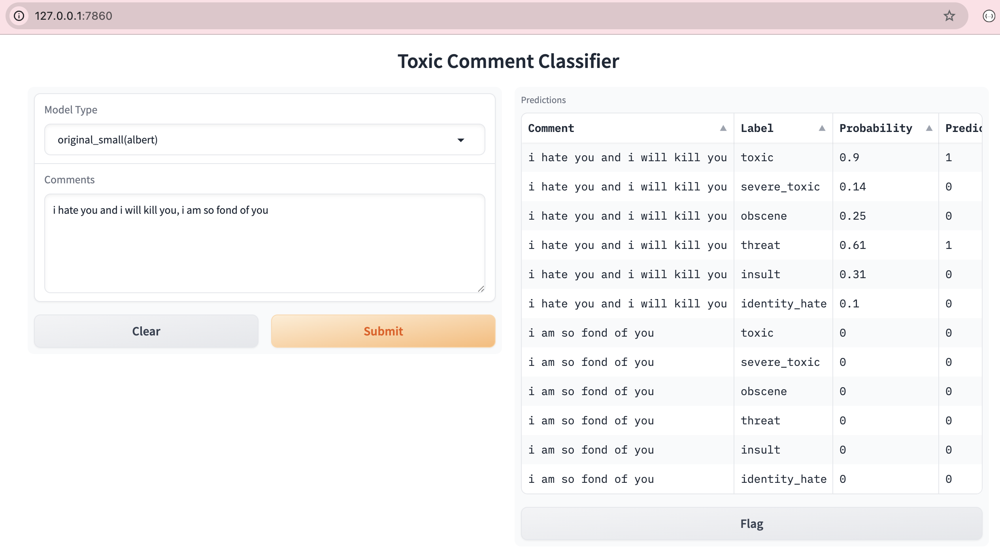
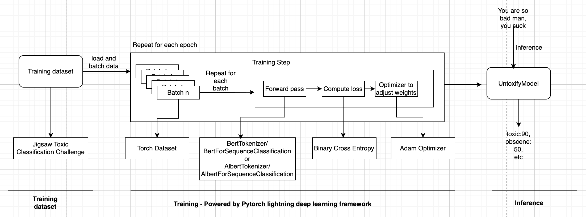

# Toxic Comment Classification with ⚡ Lightning and 🤗 Transformers

# Overview
Toxicity in language models relates to the use of offensive, vulgar, or otherwise inappropriate language, usually in the form of the model’s response to a prompt. Toxic outputs occur because models are trained on vast amounts of language data. Any toxic language, or otherwise harmful biases within the training data, is learned by the model. Since LLMs work by predicting the next most likely word in a sequence, they regularly output stereotypes based on the language they are trained on.

This repo provides model and code for fine-tuning a transformer model on a specific use case and a specific dataset. Specific use case is multi-label toxic classification and specific dataset is a large number of Wikipedia comments which have been labeled by human raters for toxic behavior. 

Used in LLM Observability suite to detect and monitor potentially harmful or inappropriate content within LLM outputs.

# Prediction
1. git clone https://github.com/furqan-shaikh/toxic-classifier.git
2. Create python virtual environment and install requirements

## Run using python code
   ```python
   from prediction_runner import run_prediction
   results = run_prediction(model_type="original_small",
                            comments=["i dont like you, you sucker","i like you"])
   # [
   #    [{'label': 'toxic', 'probability': 0.95, 'prediction': 1},
   #    {'label': 'severe_toxic', 'probability': 0.03, 'prediction': 0}, 
   #    {'label': 'obscene', 'probability': 0.53, 'prediction': 1},
   #    {'label': 'threat', 'probability': 0.01, 'prediction': 0},
   #    {'label': 'insult', 'probability': 0.82, 'prediction': 1},
   #    {'label': 'identity_hate', 'probability': 0.02, 'prediction': 0}],
   
   #    [{'label': 'toxic', 'probability': 0.01, 'prediction': 0},
   #    {'label': 'severe_toxic', 'probability': 0.0, 'prediction': 0}, 
   #    {'label': 'obscene', 'probability': 0.0, 'prediction': 0},
   #    {'label': 'threat', 'probability': 0.0, 'prediction': 0},
   #    {'label': 'insult', 'probability': 0.0, 'prediction': 0},
   #    {'label': 'identity_hate', 'probability': 0.0, 'prediction': 0}]
   # ]
   ```

## Run using Gradio
1. Run: `python gradio_app.py`
2. Launch the URL in a browser: `http://127.0.0.1:7860`
3. Enter comments separated by `,` and click `Submit`.
4. Results are shown in `Predictions` UI


## Run using curl
1. Run: `uvicorn api_server:app --reload`
2. Run the curl command:
    ```curl
    curl -X POST http://localhost:8000/predict \
        -H "Content-Type: application/json" \
        -d '{
            "model_type": "original_small",
            "comments": ["you suck", "hope you have a great day!"]
        }'
    ```

# Training
1. Download data from Kaggle here
2. Under `config/training_toxic_classification_config.json`, make the following changes:
    - add path of the training csv under `data/training/path`
3. Create python virtual environment and install requirements
4. Run: `python training_runner.py`
5. At the end of the training, the fine-tuned model is available at the path provided in config json

## Architecture


## Dataset
- Untoxify uses Jigsaw Toxic Classification dataset [here](https://www.kaggle.com/competitions/jigsaw-toxic-comment-classification-challenge)
- Consists of real world Wikipedia comments labelled by human raters for toxic behaviour
- The types of toxicity are:
    - toxic
    - severe_toxic
    - obscene
    - threat
    - insult
    - identity_hate
- Schema:
    - `comment_text`: `str`, contains the comment
    - Each of the above type is a binary label marked as either 0/1

## Terminology
- **Epoch**: One complete pass through the entire training dataset. Multiple epochs are run
- **Batch**: Training dataset is divided into smaller subsets (batches), and each batch is processed one at a time.
- **Loss Function**: Tells the model how wrong its predictions are. Goal of training is to **minimize this loss**, so the model improves over time
- **Optimizer**: adjusts the model's weights to **reduce the loss**
- **Logit**: raw output of the model which can be any real number from -∞ to +∞. Generally logit is converted into probability using softmax/sigmoid functions which reduces the value between 0 and 1.

## PyTorch Dataset and DataLoaders
We ideally want dataset code to be decoupled from model training code for better readability and modularity. PyTorch provides 2 data primitives:
  - `torch.utils.data.Dataset` : allows you to use pre-loaded datasets as well as your own data. Dataset stores the samples and their corresponding labels 
  - `torch.utils.data.DataLoader` : wraps an iterable around the Dataset to enable easy access to the samples.
We have written a custom Dataset class to load train and test data. 

## Model and Tokenizer
We use `albert-base-v2` as a model type which is smaller than `bert-base-uncased` — in terms of parameters (~12M as compared to ~110M), but not performance. We use `AlbertForSequenceClassification` which has a LM head for sequence classification which is exactly what we need. The tokenizer used is `AlbertTokenizer` which uses `SentencePiece`.

## Binary Cross Entropy:
 - Binary Cross-Entropy measures how close your predicted probability is to the actual binary label.
 - Intuition: If the **true label is 1**, we want the predicted probability to be **close to 1**.  If the **true label is 0**, we want the predicted probability to be **close to 0**.
 - Used as a loss function when
    - Ground truth is a **yes/no (1/0)** decision (i.e., class labels)
    - Predictions must be **probabilities** between 0 and 1 (from the model)
    - For a training instance such as ("you are sucker", [1, 1]), model will predict 2 probabilities (like [0.9, 0.8]), and BCE will compare each with the ground truth.
 - It compares the predicted probability (e.g., 0.8) with the true label (e.g., 1).

## Optimizer(*)
- The purpose of an Optimizer in training of a model is to adjust the model's weights to **reduce the loss** - so the model makes **better predictions** next time.

## PyTorch Lightning
- Deep learning framework to pretrain, finetune and deploy AI models
- Built on top of PyTorch that helps you organize your code and reduce the boilerplate
- Quickstart
    1. >: `pip install lightning`
    2. Define a Lightning Module which contains your training step, forward pass, loss function, optimizer, validation, etc. All of these are defined as methods in the class which keeps things organized. Lightning invokes these methods at appropriate times during the fine-tuning process
    3. Run the Trainer passing the model as defined above (i.e. instance of Lightning Module) and training dataset

## Training time
- Ran the training on Macbook Pro which took `3:18:11` for `1` epoch and `15958` training instances

# What's pending
1. Model Evaluation
2. Multilingual Toxic Comment Classification
3. Unintended Bias in Toxicity Challenge
4. Monitor training progress with tensorboard